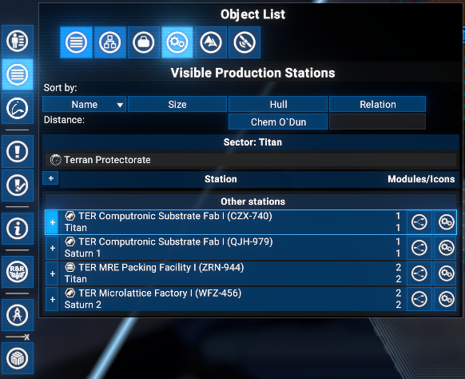
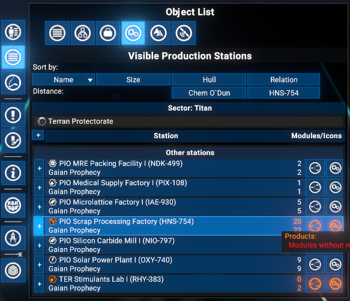
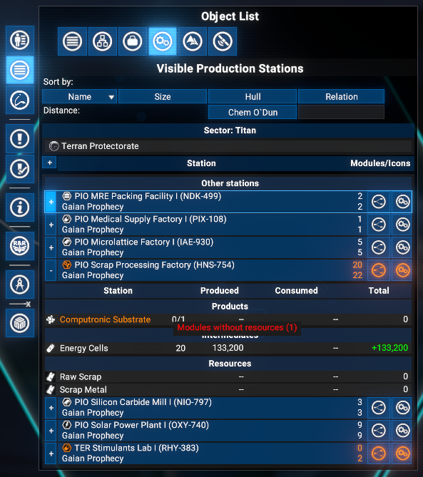
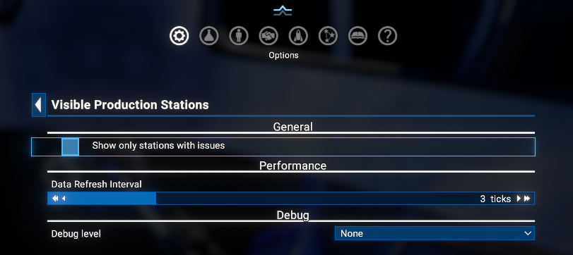

# Visible Production Stations

Adds a **Visible Production Stations** tab to the **Object List** panel in the map. Lists all production stations currently visible on the map - both player-owned and NPC - with per-station production data and quick-navigation buttons.

## Features

- **Visible Production Stations Tab**: A dedicated tab in the Object List panel lists all production stations currently visible on the map that contain production or processing modules.
- **Player and NPC stations**: Both player-owned and NPC stations are included. Player stations always show the full ware breakdown; NPC stations show ware details when the Logical Station Overview visibility rules allow it.
- **Station icon with issue indicator**: The station class icon is shown next to the station name and tinted in warning colour when any production module has an issue.
- **Production ware breakdown**: Expand a station row to see per-ware produced, consumed, and net total amounts per hour (player stations and NPC stations where ware data is accessible).
- **Ware icons**: Each ware row shows the ware icon alongside its name for quick visual identification.
- **Production issue indicators**: If any production modules for a ware are waiting for resources or waiting for storage, the ware name is highlighted in warning colour and a mouseover tooltip lists the exact issue counts per state.
- **Active module count**: The module count column shows how many modules are currently running out of the total installed (e.g. `3/5`).
- **Ware grouping**: Wares are grouped into **Products** (not consumed on-site), **Intermediates** (produced and consumed on-site), and **Resources** (pure inputs, not produced on-site).
- **Limited info for NPC stations**: When ware data is not accessible, the expand shows working/total module count and per-issue-type counts for intermediate and production stages.
- **Quick-navigation buttons**: *Logical Station Overview* and *Station Production Overview* (when the mod is installed) icons are available on each station row.
- **Expand/collapse all**: A button in the column header row expands or collapses all station rows at once.
- **Filter by issues**: Option to show only stations that currently have at least one production issue.
- **Compatible with X4 8.00 and 9.00**.
- **Save-safe**: can be added or removed at any time without affecting saved games.

## Limitations

Because **Egosoft rejected** the proposal to expose a `C.GetMapRenderedSectors(holomap)` function for retrieving the list of sectors currently rendered on the map, this mod falls back to the vanilla approach and works only with stations visible on screen.
As a result, in most cases the data covers only a **limited number** of stations - **significantly fewer** than the total across all currently visible sectors.

## Requirements

- **X4: Foundations**: Version **8.00HF4** or higher and **UI Extensions and HUD**: Version **v8.0.4.x** or higher by [kuertee](https://next.nexusmods.com/profile/kuertee?gameId=2659).
  - Available on Nexus Mods: [UI Extensions and HUD](https://www.nexusmods.com/x4foundations/mods/552)
- **X4: Foundations**: Version **9.00 beta 3** or higher and **UI Extensions and HUD**: Version **v9.0.0.0.8.4** or higher by [kuertee](https://next.nexusmods.com/profile/kuertee?gameId=2659).
- **Mod Support APIs**: Version 1.95 or higher by [SirNukes](https://next.nexusmods.com/profile/sirnukes?gameId=2659).
  - Available on Steam: [SirNukes Mod Support APIs](https://steamcommunity.com/sharedfiles/filedetails/?id=2042901274)
  - Available on Nexus Mods: [Mod Support APIs](https://www.nexusmods.com/x4foundations/mods/503)

## Installation

- **Steam Workshop**: [Visible Production Stations](https://steamcommunity.com/sharedfiles/filedetails/?id=3721057940) - only for **Game version 8.00** with latest Steam version of the `UI Extensions and HUD` mod (version 80.43 from April 8).
- **Nexus Mods**: [Visible Production Stations](https://www.nexusmods.com/x4foundations/mods/2101)

## Usage

Open the map and click the **Visible Production Stations** tab in the Object List panel tab strip. The tab is visible whenever you are on any sector map view.

All production stations currently visible on the map that contain at least one production or processing module are listed. Player stations and NPC stations are shown in separate sections.

To see per-ware production data, expand a station row with the **+** button.

### Station row

Each station row contains:

- **+/-** expand button on the left to reveal the ware breakdown or limited-info summary.
- Station class icon (tinted warning colour if any production module has an issue) and the station name with sector underneath, with a tooltip showing the possible production issues.
- **Active/Total** module count on the right side (highlighted in warning colour when issues are present).
- **Logical Station Overview** button - opens the Logical Station Overview (tinted warning colour when the station has production issues).
- **Station Production Overview** button - opens the Station Production Overview tab in the right info panel for this station. Available only when the `Station Production Overview` mod is installed.

### Ware breakdown (player stations and accessible NPC stations)

After expanding a station row, a table appears with one row per ware:

- **Ware**: icon and name (highlighted in warning colour if there are production issues for that ware), with module count (`active/total`) on the right.
- **Produced**: amount produced per hour.
- **Consumed**: amount consumed per hour.
- **Total**: net amount per hour.

Wares are grouped into **Products**, **Intermediates**, and **Resources**.

### Limited info (NPC stations where ware data is not visible)

When ware data is not accessible for an NPC station, the expand shows:

- Working/total module count.
- Per-issue-type rows for intermediate and production stages (modules waiting for resources, modules waiting for storage).

### Column headers and expand/collapse all

The **+/-** button in the column header row expands or collapses all station rows simultaneously.

### Extension options

**Options Menu > Extension options > Visible Production Stations**:

- **Show only stations with issues**: When checked, only stations that have at least one production module in an error state are listed.
- **Data Refresh Interval** (1-10, default 3): Number of UI ticks between data recalculations. Lower values make the display more responsive; higher values reduce CPU usage.

## Credits

- **Author**: Chem O`Dun, on [Nexus Mods](https://next.nexusmods.com/profile/ChemODun/mods?gameId=2659) and [Steam Workshop](https://steamcommunity.com/id/chemodun/myworkshopfiles/?appid=392160)
- Based on the production data logic from the [Production Stations Tab](https://www.nexusmods.com/x4foundations/mods/2052) mod by the same author.
- *"X4: Foundations"* is a trademark of [Egosoft](https://www.egosoft.com).

## Acknowledgements

- [EGOSOFT](https://www.egosoft.com) - for the X series.
- [kuertee](https://next.nexusmods.com/profile/kuertee?gameId=2659) - for the `UI Extensions and HUD` that makes this extension possible.
- [SirNukes](https://next.nexusmods.com/profile/sirnukes?gameId=2659) - for the `Mod Support APIs` that power the UI hooks.

## Changelog

### [8.00.01] - 2026-05-05

- **Added**
  - Initial public version.
